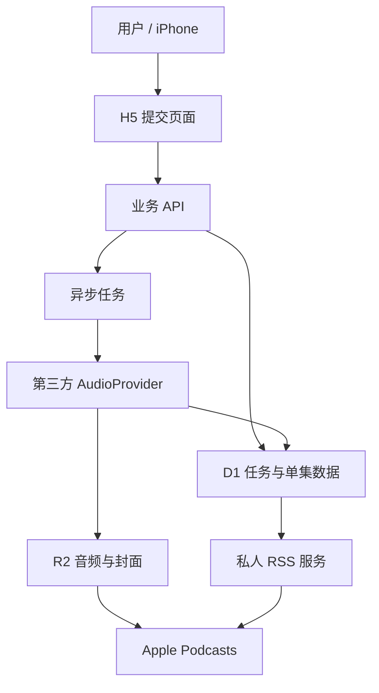

# YouTube 转私人播客：需求与技术可行性调研报告

- 日期：2026-06-23
- 阶段：需求与技术可行性调研
- 状态：调研结论草案，第三方音频 API 尚待实测

## 1. 摘要

本项目希望把 YouTube 上的访谈视频转换为私人播客，解决 YouTube 在锁屏、后台和离线收听方面的不便。用户主要收听访谈节目，其中包括英语访谈，因此需要保留完整、清晰的原始音频，并使用手机上成熟的播客播放器完成倍速、断点续播、离线下载和锁屏控制。

推荐的产品形态是：

> 用户在手机 H5 页面粘贴 YouTube 链接，云端获得视频元数据与音频，将音频保存到对象存储，并更新一条私人 RSS。用户只需在 Apple Podcasts 中订阅一次该 RSS，后续转换成功的视频会自动成为新的播客单集。

推荐的 MVP 技术组合是 Cloudflare Pages、Workers、D1 和 R2，第三方音频 API 负责获得音频。系统必须通过统一的 `AudioProvider` 接口隔离具体供应商，以便供应商失效时快速切换。

当前最大的不确定性不是 RSS、数据库或存储，而是第三方 YouTube 音频 API 的稳定性与合规风险。因此，在进入正式产品设计前，应先实测 2–3 家候选供应商。

## 2. 背景与用户痛点

### 2.1 使用背景

- 用户经常观看 YouTube 访谈节目。
- 用户希望在通勤、走路或做其他事情时继续收听。
- 部分访谈为英语内容，收听也是英语听力训练的一部分。
- 手机是最方便的消费终端，主要播放器为 iPhone 自带的 Apple Podcasts。

### 2.2 核心痛点

- YouTube 在锁屏和后台播放方面存在限制。
- 视频形式比纯音频消耗更多流量和电量。
- 长访谈需要倍速、断点续播、离线下载和锁屏控制。
- 手动下载、转换、传入手机的流程繁琐，无法形成持续使用习惯。

### 2.3 目标

第一版需要实现：

1. 用户在手机 H5 页面粘贴一个 YouTube 链接。
2. 系统异步获取视频元数据和音频。
3. 系统将音频转存为 Apple Podcasts 可播放的播客单集。
4. 用户通过私人 RSS 在 Apple Podcasts 中收听。
5. 系统支持锁屏、后台、倍速、断点续播和离线下载；这些播放能力由 Apple Podcasts 提供。

### 2.4 第一版不做

- 不开发独立 iOS App。
- 不公开提交到 Apple Podcasts 播客目录。
- 不做多人共享或公开搜索。
- 不自动同步 YouTube 播放列表。
- 不支持会员、私密、年龄限制或需要登录的视频。
- 暂不提供字幕学习、逐句跟读和双语文本功能。

## 3. 已确认的产品决策

| 决策项 | 当前结论 |
|---|---|
| 使用终端 | iPhone |
| 播放器 | Apple Podcasts |
| 内容载体 | 私人播客 RSS |
| 提交入口 | 手机 H5 页面 |
| 提交方式 | 手动粘贴 YouTube 链接 |
| 部署方式 | 云服务 |
| 云平台倾向 | Cloudflare |
| 数据存储 | D1 保存任务和单集信息 |
| 文件存储 | R2 保存音频和封面 |
| 音频来源 | 优先调研第三方音频 API |
| 产品范围 | 当前以个人使用为主 |

## 4. 私人 RSS 的工作机制

RSS 是一个遵循 RSS 2.0 规范的 XML 内容清单。它不是音频传输协议，也不是主动推送服务。

Apple Podcasts 会定期访问固定的 RSS URL，检查是否出现新的 `<item>`。每个单集通过 `<enclosure>` 告诉播放器音频文件的位置、大小和类型：

```xml
<item>
  <title>Inside Anthropic</title>
  <guid>youtube:v1wZwxY3CMg</guid>
  <enclosure
    url="https://media.example.com/audio/v1wZwxY3CMg.m4a"
    length="58230000"
    type="audio/mp4"
  />
</item>
```

Apple Podcasts 的读取流程是：

1. 定期访问私人 RSS URL。
2. 发现新的单集和唯一 GUID。
3. 在用户资料库中显示新单集。
4. 播放或下载时访问 `<enclosure>` 中的音频 URL。

Apple 官方确认，iPhone Podcasts 可以通过“资料库 → 更多 → 通过 URL 关注节目”手动添加有效 RSS。[Apple：在 iPhone 上查找播客](https://support.apple.com/en-ie/guide/iphone/iph19bb8e705/ios)

## 5. 整体架构



### 5.1 H5 页面

职责：

- 粘贴和提交 YouTube URL。
- 展示等待、处理中、完成和失败状态。
- 展示历史单集。
- 支持重试、删除和复制 RSS 地址。

H5 不负责下载或处理音频。建议部署在 Cloudflare Pages。

### 5.2 业务 API

职责：

- 验证 URL 和视频 ID。
- 创建任务并防止重复提交。
- 查询、更新和删除任务。
- 对 H5 进行私人访问控制。
- 输出私人 RSS。

建议使用 Cloudflare Workers。RSS 可以由同一个 Worker 动态生成，无需单独部署服务。

### 5.3 异步任务

音频获取可能持续数十秒或更久，不能让 H5 请求一直等待。API 创建任务后应立即返回 `jobId`，后续由异步执行器处理。

建议状态机：

```text
pending → inspecting → fetching → uploading → completed
                                      ↘ failed
```

每次失败需要记录阶段、错误码和可读错误信息，并支持人工重试。

### 5.4 第三方 AudioProvider

职责：

- 接收 YouTube URL。
- 获取或补齐标题、时长、封面和频道信息。
- 返回可下载的音频地址或音频流。
- 将音频及时转存到 R2。
- 把最终格式、文件大小和时长写入 D1。

第三方返回的签名 URL 往往会过期，不能直接写入 RSS。

### 5.5 D1 数据库

D1 只保存结构化数据，不保存音频。核心字段包括：

```text
job_id
user_id
youtube_video_id
source_url
title
description
channel_name
thumbnail_url
published_at
duration_seconds
status
provider
audio_object_key
audio_mime_type
audio_bytes
failure_code
failure_message
created_at
updated_at
```

### 5.6 R2 对象存储

建议对象路径：

```text
audio/<user-id>/<video-id>.m4a
artwork/<user-id>/<video-id>.jpg
```

音频访问端点需要支持 HTTPS、HEAD、Content-Length 和 Byte Range，以保证 Apple Podcasts 可以检测文件、跳播和断点续播。Apple 要求 RSS 2.0 feed 中的每个单集包含唯一 enclosure URL、长度和 MIME 类型，并要求托管服务器支持 HEAD 与 byte-range 请求。[Apple：Podcast RSS feed requirements](https://podcasters.apple.com/support/823-podcast-requirements)

## 6. 音频格式建议

Apple Podcasts 当前接受 RSS 中的 MP3 或 AAC。Apple 更推荐使用 MP4 容器中的 AAC，因为相同比特率下文件更小、音质更好，并且流式播放和跳转更准确。[Apple：Audio requirements](https://podcasters.apple.com/support/893-audio-requirements)

第一版推荐：

```text
容器：M4A / MP4
编码：AAC
采样率：44.1 或 48 kHz
声道：保留原始声道
默认码率：立体声 128 kbps
MIME：audio/mp4
```

若第三方只提供 MP3，可作为兼容降级。320 kbps MP3 对访谈音频过大，不应作为首选：

```text
1 小时 MP3 320 kbps 约 144 MB
1 小时 AAC 128 kbps 约 58 MB
```

## 7. YouTube 数据获取方式

### 7.1 官方元数据 API

YouTube Data API v3 可以获得标题、简介、频道、发布时间、封面、时长、字幕是否存在和地区限制等信息。`videos.list` 每次调用成本为 1 个 quota unit，默认项目每天有 10,000 units，足够个人使用。[YouTube Data API 概览](https://developers.google.com/youtube/v3/getting-started)、[Videos: list](https://developers.google.com/youtube/v3/docs/videos/list)

推荐策略：

- 元数据优先使用 YouTube Data API。
- 第三方 AudioProvider 返回的元数据用于补充或交叉校验。
- 音频获取不依赖 YouTube Data API，因为官方 API 不提供音频下载地址。

### 7.2 第三方音频 API 候选

以下服务均非 YouTube 官方服务，当前信息仅用于候选筛选，不代表稳定性或合规背书。

| 服务 | 输出能力 | 试用/免费 | 起步价格 | 主要问题 |
|---|---|---:|---:|---|
| [Tunelio](https://tunelio.dev/) | MP3、直接签名 URL、元数据 | 一次性 100 credits | $9/月 | 当前明确输出 MP3 320 kbps，文件偏大 |
| [RapidAPI: YouTube Audio Video Download](https://rapidapi.com/hyoga/api/youtube-audio-video-download/pricing) | 音频和视频 | 50 次/天 | $10/月 | 独立供应商托管，文档和 SLA 需验证 |
| [YT2Mp3Converter API](https://yt2mp3converter.in/api) | MP3、M4A、WAV、直接 URL | 无信用卡试用 | $20/月 | 服务较新，稳定性待验证 |
| [Zyla Audio Extraction](https://www.zylalabs.com/api-marketplace/music%2B%26%2Baudio/youtube%2Baudio%2Bextraction%2Bapi/8354) | MP3 128 kbps、下载 URL | 7 天/50 次 | $24.99/月 | 单条音频最长 90 分钟 |
| [Yout API](https://yout.com/api/) | MP3 format-shifting | 注册后确认 | credits 计费 | 定价透明度和返回细节一般 |
| [Cobalt](https://github.com/imputnet/cobalt) | 多平台、多音视频格式 | 开源 | 自建成本 | 不是托管 API，需要自行维护 |

### 7.3 初步候选排序

1. **YT2Mp3Converter**：优先验证 M4A 输出是否真实、稳定，可否直接转存 R2。
2. **Tunelio**：接口简单、价格较低，适合验证直接 CDN URL 流程。
3. **RapidAPI 候选**：免费额度适合低成本对照测试，但需防止供应商下架。

Zyla 因 90 分钟上限，不适合作为长访谈的主供应商。

## 8. AudioProvider 抽象设计

业务层不能直接依赖某一家第三方 API。建议定义统一能力：

```ts
interface AudioProvider {
  inspect(youtubeUrl: string): Promise<VideoInfo>
  extract(youtubeUrl: string): Promise<AudioResult>
}
```

统一结果至少包含：

```json
{
  "downloadUrl": "https://temporary.example/audio",
  "mimeType": "audio/mp4",
  "fileExtension": "m4a",
  "fileSize": 58230000,
  "durationSeconds": 2860,
  "expiresAt": "2026-06-23T12:00:00Z"
}
```

推荐实现：

```text
Yt2Mp3Provider
TunelioProvider
RapidApiProvider
```

第一版可以只启用一个主供应商，但数据库应保存 `provider`，错误模型和调用层必须从一开始支持替换。

## 9. Cloudflare 免费额度与成本

### 9.1 D1

Workers Free 当前包含：

- 每天读取 500 万行。
- 每天写入 10 万行。
- 总存储 5 GB。
- D1 数据传输免费。

个人播客的任务和单集数据很小，免费额度足够。[Cloudflare D1 Pricing](https://developers.cloudflare.com/d1/platform/pricing/)

### 9.2 R2

R2 Standard 当前每月免费额度包括：

- 10 GB-month 存储。
- 100 万次 Class A 操作。
- 1,000 万次 Class B 操作。
- 公网 egress 免费。

按 AAC 128 kbps 粗略估算，10 GB 可保存约 170 小时音频。免费存储不会每月累加；音频持续保留后最终可能超限。超出部分当前为 `$0.015/GB-month`。[Cloudflare R2 Pricing](https://developers.cloudflare.com/r2/pricing/)

### 9.3 成本判断

- H5、API、RSS、D1 和 R2 在个人使用阶段大概率保持免费。
- 最先产生实际费用的部分很可能是第三方音频 API。
- 若第三方只提供高码率 MP3，R2 存储增长速度会明显加快。

## 10. 隐私与访问控制

第一版为个人服务，建议采用简单但明确的双层保护：

1. H5 和管理 API 使用登录或访问令牌。
2. RSS 使用不可猜测的随机 token URL，例如：

```text
https://pod.example.com/feed/8fK2x9...a91.xml
```

RSS URL 应视为密码。若泄露，需要支持 token 轮换。第三方 API 密钥、R2 凭据和回调签名密钥只能保存在 Cloudflare Secrets 中，不得暴露到前端或 RSS。

## 11. 合规与平台风险

YouTube 官方开发者政策禁止在未获得 YouTube 书面批准的情况下下载、缓存或保存 YouTube 音视频，也禁止提供离线播放、分离音频或后台播放能力。[YouTube API Services Developer Policies](https://developers.google.com/youtube/terms/developer-policies)

因此需要明确：

- 第三方音频 API 技术上可用，不等于获得 YouTube 或内容作者授权。
- 本项目当前定位为个人使用，RSS 不公开、不搜索、不分享。
- 应优先处理用户拥有版权、获得授权或明确允许下载的内容。
- 如果未来开放给其他用户，必须重新进行合规评估，不能直接沿用个人工具假设。

## 12. 风险清单

| 风险 | 影响 | 初步应对 |
|---|---|---|
| 第三方音频 API 失效 | 无法新增单集 | AudioProvider 抽象、多供应商备用 |
| 临时 URL 过期 | RSS 音频不可播放 | 成功后立即转存 R2 |
| 云机房 IP 被 YouTube 限制 | 获取失败率升高 | 供应商对照测试、保留替换能力 |
| 长访谈超过供应商限制 | 部分节目无法转换 | 用 2–3 小时样本做硬性验收 |
| 只提供 320 kbps MP3 | 存储增长过快 | 优先选择 M4A/AAC 或 128 kbps MP3 |
| Apple Podcasts RSS 刷新延迟 | 新节目不能立即出现 | H5 显示已完成；提供刷新说明 |
| RSS URL 泄露 | 他人可访问私人音频 | 高熵 token、支持轮换 |
| 平台条款或版权风险 | 产品无法公开运营 | 限定个人/授权内容，公开前重新评估 |

## 13. MVP 功能需求

### 13.1 必须具备

- H5 粘贴 YouTube 链接。
- URL、视频 ID 和重复任务校验。
- 异步任务状态展示。
- 获取标题、频道、时长和封面。
- 通过一个 AudioProvider 获得音频。
- 将音频与封面转存至 R2。
- 将任务和单集数据写入 D1。
- 输出 Apple Podcasts 可订阅的 RSS 2.0。
- 支持失败原因、人工重试和删除。
- 提供私人 RSS token。

### 13.2 应该具备

- 音频格式和 MIME 校验。
- 最大视频时长与文件大小限制。
- Provider 超时和统一错误码。
- R2 存储清理机制。
- RSS token 轮换。
- 基础日志和任务耗时记录。

### 13.3 后续能力

- iOS 分享菜单快速提交。
- 指定 YouTube 播放列表自动同步。
- 英文字幕与时间轴。
- 双语字幕、单句循环和听力训练模式。
- 多用户和配额控制。

## 14. 第三方 API 验证计划

在确定供应商前，应使用同一批视频测试 YT2Mp3Converter、Tunelio 和一个 RapidAPI 候选。

### 14.1 测试样本

- 30 分钟普通公开视频。
- 约 60 分钟英语访谈。
- 2 小时以上长访谈。
- 近期热门视频。
- 含章节、多语言或自动字幕的视频。

### 14.2 记录指标

- 是否成功。
- 首次响应时间和总耗时。
- 返回的是直接流、临时 URL 还是异步任务。
- URL 有效期。
- 实际音频容器、编码、码率和声道。
- 文件大小和时长是否准确。
- 是否支持 M4A/AAC。
- 是否支持 HEAD 和 Range。
- 错误信息是否可用于重试。
- 同一视频重复调用是否重复计费。
- 超长视频、地区限制和近期视频的成功率。

### 14.3 供应商准入标准

主供应商至少应满足：

- 公开测试样本成功率达到 95%。
- 支持不少于 3 小时的视频，或明确覆盖目标访谈长度。
- 返回可由服务端直接读取的音频流或签名 URL。
- 音频能够稳定转存 R2。
- 单次失败有明确错误码，不产生不可控扣费。
- 价格和速率限制透明。

## 15. 推荐路线

推荐按以下顺序推进：

1. 使用 YouTube Data API 验证元数据获取。
2. 对三家第三方音频 API 做小规模 PoC。
3. 根据实测确定主供应商和备用供应商。
4. 冻结 AudioProvider 输入、输出和错误模型。
5. 完成正式产品设计规格。
6. 编写实施计划并开发 MVP。
7. 用真实 iPhone 和 Apple Podcasts 做端到端验收。

第一版推荐架构结论：

```text
Cloudflare Pages：H5
Cloudflare Workers：API + RSS
Cloudflare D1：任务与单集数据
Cloudflare R2：音频与封面
YouTube Data API：官方元数据
第三方 AudioProvider：音频获取
Apple Podcasts：手机播放
```

## 16. 尚待确认的产品决策

- 音频永久保留，还是按 90/180 天清理。
- RSS 中删除旧单集时，是否同步删除 R2 文件。
- 首选 M4A，不可用时是否接受 MP3 自动降级。
- 单条视频最大允许时长。
- H5 的身份验证方式。
- 第三方主供应商和备用供应商。
- 是否在 MVP 中保留字幕文件，为英语学习功能铺路。

在这些事项确认、音频 API 实测完成后，本报告可转化为正式产品设计规格和实施计划。
