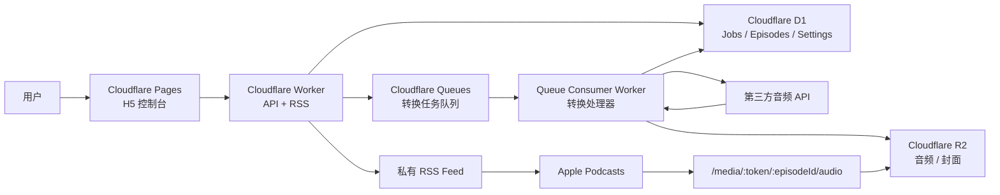

# YouTube 转私人播客 MVP 设计规格

日期：2026-06-24

## 1. 背景

这个项目的目标是把 YouTube 视频转换成私人播客 episode，让用户可以在 Apple Podcasts 中订阅并播放，从而解决 YouTube 锁屏后无法继续播放、访谈节目不方便随时听、英语访谈不方便作为听力材料的问题。

第一版不是公开视频平台，也不是完整播客托管平台，而是一个给个人使用的“私人 YouTube-to-Podcast 管道”。

## 2. 已确认决策

- 使用对象：只给自己用。
- 添加方式：H5 页面粘贴单个 YouTube 视频链接。
- 播放载体：Apple Podcasts 订阅私人 RSS。
- 部署倾向：Cloudflare 免费或低成本服务优先。
- 音频处理：第一版只接第三方音频 API，不自建 YouTube 下载/转码服务。
- 任务执行：使用 Cloudflare Queues 做异步转换任务。
- 音频存储：转换完成后的音频保存到 Cloudflare R2。
- 音频访问：通过 Worker `/media/...` 代理 R2 文件，不公开 R2 bucket。
- 访问保护：使用管理 token 和 RSS token 两套 token。

## 3. MVP 范围

第一版只做一个最小闭环：

1. 打开 H5 控制台。
2. 粘贴一个 YouTube 视频链接。
3. 系统创建转换任务。
4. Cloudflare Queues 异步处理任务。
5. 第三方音频 API 提取音频。
6. 服务把音频保存到 R2。
7. 服务把标题、封面、时长、音频地址等信息写入 D1。
8. Worker 输出带私密 token 的 RSS feed。
9. 用户在 Apple Podcasts 里订阅这个 RSS。
10. 新视频转换完成后，Apple Podcasts 下次刷新时看到新 episode。

第一版明确不做：

- 多用户注册登录。
- YouTube 频道自动同步。
- YouTube 播放列表自动展开。
- 评论、收藏、播放进度同步。
- Web 端播放器。
- 复杂后台管理。
- 自建 YouTube 下载/转码服务。
- 原生 iOS App。
- YouTube 私密、会员、登录态或地区限制视频支持。
- 音频剪辑、降噪、转写、总结。

## 4. 推荐架构



### 4.1 H5 控制台

H5 是一个轻量控制台，不是播放器。

职责：

- 输入 YouTube 链接。
- 提交转换任务。
- 展示任务状态。
- 展示最近已完成 episode。
- 展示私人 RSS 地址。
- 对失败任务发起手动重试。

H5 调用管理 API 时必须携带管理 token。管理 token 不应硬编码在公开源码中；本地开发可以通过环境变量或手动输入方式提供。

### 4.2 Worker API

Worker API 是服务入口，负责轻量业务逻辑：

- 校验 YouTube URL。
- 解析 `youtube_video_id`。
- 查重，避免重复转换同一视频。
- 创建 job。
- 向 Queue 投递转换任务。
- 查询 job 状态。
- 查询 episode 列表。
- 输出 RSS XML。
- 代理 R2 音频文件。

Worker API 不直接执行耗时转换。

### 4.3 Queue Consumer Worker

Queue Consumer 是后台转换处理器，只负责重活：

- 从 Queue 取 job。
- 标记 job 为 `processing`。
- 调用第三方音频 API。
- 获取临时音频下载地址和 metadata。
- 下载音频并上传到 R2。
- 可选地下载封面并上传到 R2。
- 写入 episode。
- 标记 job 为 `completed` 或 `failed`。

### 4.4 D1 数据库

D1 是唯一状态源。H5、RSS、任务状态都从 D1 读取，不从第三方音频 API 读取。

### 4.5 R2 存储

R2 保存最终可播放资产：

- 音频文件。
- 可选封面图片。

第三方音频 API 返回的临时 URL 不写入 RSS，不作为长期播放地址。

### 4.6 私有 RSS

RSS endpoint：

```txt
GET /rss/:token.xml
```

RSS token 用于 Apple Podcasts 订阅。token 错误时返回 404，避免暴露 feed 是否存在。

每个 episode 至少包含：

- `title`
- `description`
- `pubDate`
- `guid`
- `enclosure url`
- `enclosure type`
- `enclosure length`
- `itunes:duration`
- `itunes:image`

### 4.7 媒体代理

音频 endpoint：

```txt
GET  /media/:token/:episodeId/audio
HEAD /media/:token/:episodeId/audio
```

必须支持 `Range` 请求。Apple Podcasts 对长音频播放、拖动进度、缓存下载会依赖 `HEAD` 和 `Range` 行为。

## 5. 数据模型

### 5.1 `jobs`

保存每次转换任务。

字段：

- `id`
- `youtube_url`
- `youtube_video_id`
- `status`
- `error_message`
- `provider`
- `attempt_count`
- `episode_id`
- `created_at`
- `updated_at`
- `completed_at`

状态枚举：

- `pending`
- `processing`
- `uploading`
- `completed`
- `failed`

### 5.2 `episodes`

保存 RSS 所需的单集信息。

字段：

- `id`
- `youtube_video_id`
- `youtube_url`
- `title`
- `description`
- `channel_title`
- `thumbnail_url`
- `r2_audio_key`
- `r2_image_key`
- `audio_mime_type`
- `audio_file_size`
- `duration_seconds`
- `guid`
- `published_at`
- `created_at`

约束：

- `youtube_video_id` 应唯一，避免重复转换。
- `guid` 应唯一且长期稳定。

### 5.3 `settings`

保存少量配置，方便后续从 H5 修改。

字段：

- `key`
- `value`

建议初始配置：

- `podcast_title`
- `podcast_description`
- `podcast_author`
- `rss_token`
- `default_audio_provider`

`admin_token` 和 provider API key 属于敏感凭证，第一版只放 Cloudflare 环境变量，不写入 D1。RSS token 和播客展示信息可以保留在 `settings`，方便后续通过 H5 修改。

## 6. API 设计

### 6.1 管理 API

所有 `/api/*` 请求都需要管理 token。

```txt
POST /api/jobs
GET  /api/jobs
GET  /api/jobs/:id
POST /api/jobs/:id/retry
GET  /api/episodes
```

#### `POST /api/jobs`

请求：

```json
{
  "youtubeUrl": "https://www.youtube.com/watch?v=..."
}
```

行为：

- 校验 URL。
- 解析 videoId。
- 如果 videoId 已有 completed episode，返回已有 episode，不重复入队。
- 否则创建 `pending` job 并投递 Queue。

返回：

```json
{
  "jobId": "job_...",
  "status": "pending"
}
```

#### `GET /api/jobs/:id`

返回单个任务状态。

```json
{
  "id": "job_...",
  "status": "processing",
  "errorMessage": null,
  "episodeId": null
}
```

#### `POST /api/jobs/:id/retry`

只允许重试 `failed` job。

行为：

- `attempt_count + 1`
- 清空或更新 `error_message`
- 标记为 `pending`
- 重新投递 Queue

### 6.2 RSS API

```txt
GET /rss/:token.xml
```

行为：

- token 正确时输出 RSS 2.0 XML。
- token 错误时返回 404。
- episode 按 `created_at` 或 `published_at` 倒序输出。

### 6.3 媒体 API

```txt
GET  /media/:token/:episodeId/audio
HEAD /media/:token/:episodeId/audio
```

行为：

- token 错误时返回 404。
- 找不到 episode 时返回 404。
- 读取 episode 对应的 `r2_audio_key`。
- 从 R2 返回音频内容。
- 保留并正确处理 `Range`、`Content-Length`、`Content-Type`、`Accept-Ranges` 等 header。

## 7. AudioProvider 抽象

第一版只接一个第三方音频 API，但代码边界要保持可替换。

建议接口：

```ts
type AudioProviderResult = {
  title?: string
  description?: string
  channelTitle?: string
  durationSeconds?: number
  thumbnailUrl?: string
  audioDownloadUrl: string
  audioMimeType?: string
  audioFileSize?: number
}

interface AudioProvider {
  extract(youtubeUrl: string): Promise<AudioProviderResult>
}
```

第一版 provider 候选：

- Tunelio
- YT2Mp3Converter
- RapidAPI 上的 YouTube Audio 类 API

实现前需要做小样本验证。验证重点：

- 30-60 分钟访谈能否成功。
- 1-2 小时访谈能否成功。
- 返回 URL 是否会过期。
- 返回音频格式是否适合 Apple Podcasts。
- 是否能拿到文件大小。
- 是否按请求计费，重复请求如何扣费。

## 8. 错误处理

### 8.1 链接无效

情况：

- 不是 YouTube URL。
- 无法解析 videoId。
- 输入 playlist/channel 链接。

处理：

- 直接返回 400。
- 不创建 job。
- 不投递 Queue。

### 8.2 重复视频

情况：

- 同一个 `youtube_video_id` 已有 completed episode。

处理：

- 不重复转换。
- 返回已有 episode 或提示已存在。

### 8.3 第三方音频 API 失败

情况：

- 视频不可用。
- 视频太长。
- API 额度不足。
- API 返回结构异常。
- 下载地址过期。

处理：

- job 标记为 `failed`。
- 写入 `error_message`。
- H5 显示失败原因。
- 用户可手动重试。

### 8.4 R2 上传失败

处理：

- job 标记为 `failed`。
- 记录错误原因。
- 支持手动重试。
- 重试时重新请求第三方音频 API，不复用旧下载地址。

### 8.5 Token 错误

处理：

- RSS token 或 media token 错误返回 404。
- 管理 API token 错误返回 401。

## 9. 重试策略

第一版只做手动重试，不做自动重试。

原因：

- 第三方音频 API 可能按请求计费。
- 自动重试可能造成额外扣费。
- 个人工具中手动控制更安全。

规则：

- `failed` job 可手动重试。
- 每次重试 `attempt_count + 1`。
- 超过 3 次仍允许手动重试，但 H5 应提示：该视频或 provider 可能不支持。

## 10. 安全与隐私

- 不做公开注册登录。
- 管理 API 使用 admin token。
- RSS 使用 rss token。
- media 使用 rss token 或独立 media token；MVP 可复用 rss token。
- provider API key 只存在 Cloudflare 环境变量中。
- H5 不暴露 provider API key。
- R2 bucket 不公开。
- token 泄露时，可通过修改 settings 或环境变量轮换。

## 11. 验收标准

第一版成功的定义：

- 用户能在 H5 提交一个 YouTube 访谈视频。
- 系统能创建 job 并展示状态。
- Queue Consumer 能调用第三方音频 API。
- 音频能保存到 R2。
- episode 能写入 D1。
- 私人 RSS 能被 Apple Podcasts 订阅。
- Apple Podcasts 能显示 episode 标题、封面、时长。
- Apple Podcasts 能播放音频。
- 锁屏状态下能继续播放。
- 拖动进度条正常。
- 失败时 H5 能显示原因并支持手动重试。

## 12. 测试计划

### 12.1 基础提交流程

- 打开 H5 页面。
- 粘贴普通 YouTube 视频链接。
- 提交成功。
- 返回 jobId。
- 页面能看到状态变化。
- 完成后 episode 出现在列表里。

通过标准：

- D1 有 job 和 episode。
- R2 有音频文件。
- 页面无需手动刷新即可看到状态变化，或通过轮询在合理时间内更新。

### 12.2 RSS 订阅流程

- 复制私人 RSS URL。
- 在 Apple Podcasts 中通过 URL 订阅。
- 订阅成功。
- episode 信息显示正常。

通过标准：

- Apple Podcasts 能识别 feed。
- episode 能加载出来。
- RSS XML 无格式错误。

### 12.3 音频播放流程

- 在 Apple Podcasts 播放 episode。
- 锁屏后继续播放。
- 拖动进度条。
- 暂停和继续。

通过标准：

- 锁屏不断播。
- 进度拖动正常。
- 长音频不反复从头加载。
- `/media` 支持 `HEAD` 和 `Range`。

### 12.4 异常流程

- 输入非 YouTube 链接。
- 输入重复 YouTube 链接。
- 输入第三方 API 不支持的视频。
- 手动重试失败任务。
- 使用错误 RSS token 访问。

通过标准：

- 非 YouTube 链接不入队。
- 重复视频不重复调用 provider。
- 失败任务有错误原因。
- 错误 token 不暴露资源。

### 12.5 成本和额度观察

- 连续提交 5 个不同长度视频。
- 查看 D1、R2、Queues 使用量。
- 查看第三方 API 调用次数。

通过标准：

- Cloudflare 免费额度内运行。
- 第三方 API 调用次数可解释。
- 没有重复转换导致的额外扣费。

## 13. 推荐验收视频

- 10 分钟以下短视频。
- 30-60 分钟访谈。
- 1-2 小时英文访谈。
- 一个重复提交的视频。
- 一个预期失败的视频。

## 14. 实现前待确认

进入实现计划前，只剩一个需要实际验证后才能冻结的选择：第一版使用哪一个第三方音频 API provider。

建议实现计划中把 provider 接入设计成可替换，并先用一个最容易申请和测试的 provider 跑通端到端链路。如果测试发现失败率、价格或格式不可接受，再替换 provider。

## 15. 下一步

用户审阅并确认本设计规格后，进入 implementation planning。下一阶段只做实施计划拆解，不直接越过计划开始编码。
